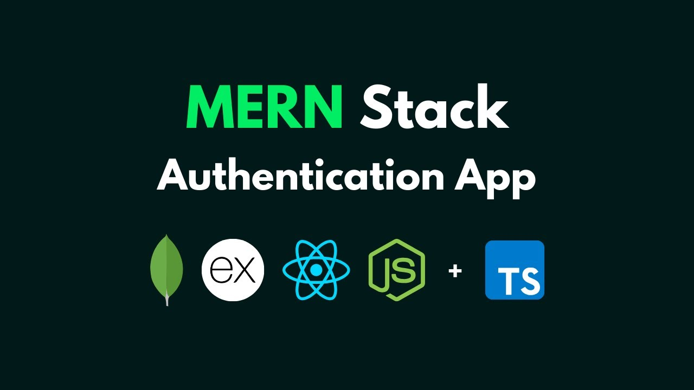

# Freelancing & Job-Seeking Platform


A **full-stack MERN** (MongoDB, Express.js, React.js, Node.js) application for connecting **freelancers** and **clients**.  
Features include **OTP-based authentication**, **role-based dashboards**, **job posting**, **applications management**, and **admin control**.

---

## 📌 Project Details

**Developer:** Nitesh Sharma  
**Email:** Niteshkumarsharma831@gmail.com  
**Tech Stack:** MERN (MongoDB, Express.js, React.js, Node.js), Tailwind CSS, JWT Auth, Cookies, Axios  

---

## 🚀 Features

- **OTP-based Sign-up & Login** (No password)
- **JWT Authentication with Cookies**
- **Role-based Dashboards**
  - Freelancer Dashboard
  - Client Dashboard
  - Super Admin Dashboard
- **Post & Manage Jobs**
- **Apply for Jobs**
- **View Applications with User Details**
- **Responsive UI** for Mobile & Desktop
- **Separate Collections for Clients & Freelancers**
- **Super Admin Management**
  - Manage Users
  - Manage Jobs
  - Manage Applications

---

## 📂 Project Structure

```

FreelancingWeb/
│── backend/           # Express.js Backend
│   ├── controllers/
│   ├── models/
│   ├── routes/
│   ├── middleware/
│   ├── utils/
│   ├── config/
│   └── server.js
│
│── frontend/          # React.js Frontend
│   ├── src/
│   │   ├── components/
│   │   ├── context/
│   │   ├── features/
│   │   ├── pages/
│   │   └── App.js
│   └── vite.config.js
│
└── README.md

````

---

## ⚙️ Installation & Setup

### 1️⃣ Clone the Repository
```bash
git clone https://github.com/Niteshsharma831/FreelancingWeb/tree/master
cd FreelancingWeb
````

### 2️⃣ Backend Setup

```bash
cd backend
npm install
```

**Create a `.env` file inside backend folder:**

```
PORT=5000
MONGO_URI=your-mongodb-connection-string
JWT_SECRET=your-jwt-secret
EMAIL_USER=your-email@example.com
EMAIL_PASS=your-email-password
```

Run Backend:

```bash
npm start
```

### 3️⃣ Frontend Setup

```bash
cd ../frontend
npm install
npm run dev
```

---

## 🔑 Default Roles & Access

| Role           | Features                                                 |
| -------------- | -------------------------------------------------------- |
| **Freelancer** | Post jobs, manage jobs, view applications, update status |
| **Client**     | Apply for jobs, manage applications                      |
| **Admin**      | Manage all jobs, users, freelancers, and clients         |

---

## 📸 Screenshots

*Add screenshots here for login, dashboard, and job posting pages.*

---

## 📢 Notes

* Make sure **MongoDB** is running.
* Ensure `.env` variables are set correctly.
* Use a **real email service** for OTP (like Gmail SMTP).

---
<p align="center">
  
</p>

## 📜 License

This project is licensed under the MIT License.

```

---

To make the image show:  
1. Create an `assets` folder in your project root.  
2. Save your provided image there as `mern-stack.png`.  
3. Commit it along with the README.  

Do you want me to also **add example screenshots** of login/dashboard placeholders in the README so it looks complete? That would make it very client-friendly.
```
